# ZENO

My take on a personal Jarvis. It's a Windows desktop app with a spinning holographic globe you click and talk to. Under the hood it runs on whatever AI model you point it at, but it works out of the box with the free ones on OpenRouter, so using it costs nothing.



I built this because I wanted one place where I could ask questions, control my PC and mess around with different models without opening six browser tabs. It grew from there.

## Getting it

Grab `ZENO-Setup` from the [latest release](https://github.com/iamyakay/zeno/releases/latest). One click, desktop shortcut, done. There's also a portable exe if you don't like installers, it just needs about half a minute to unpack itself on each launch.

Windows will probably show a SmartScreen warning because the app isn't code signed. Click More info, then Run anyway.

Running from source needs Node 18 or newer:

```
git clone https://github.com/iamyakay/zeno.git
cd zeno
npm install
npm start
```

Whichever way you install, open CONFIG on first launch, paste an OpenRouter API key (free at [openrouter.ai/keys](https://openrouter.ai/keys)) and hit save. The image generator and the PC commands work even without a key.

## What it does

You talk to it. Click the globe, say what you want, and it answers out loud. Replies stream in as they generate. Turn on the wake word in CONFIG and you can just say "hey zeno" from across the room without touching anything.

It controls your computer. Ask it to open sites and apps, search the web, change the volume, lock the screen, take screenshots, empty the recycle bin or shut the PC down on a timer. There's a live HUD around the globe showing cpu, memory, disk and uptime, and asking "system status" gets you a spoken report.

It sees things. Attach an image and ask about it, or say "look at my screen" and ZENO screenshots your display and tells you what's there. Drop a text file into the window and ask questions about its contents. Say "generate an image of whatever" and a picture appears in the chat.

It remembers. Tell it to remember something and that survives restarts. It keeps a todo list in a panel next to the globe, saves every conversation into a history browser you can resume from, and picks up your clipboard when you ask it to summarize, translate or fix whatever you copied.

The multi-AI consensus mode is my favorite part. Flip the toggle and your question goes to several models at once, each with a live timer racing next to it, and a judge model merges what they agree on. When they disagree you get told what's disputed instead of one model's confident guess.

If none of that fits what you need, the personality is editable in CONFIG and the whole command layer is extendable through plugins.

## The commands

```
open youtube / github / spotify / notepad / calculator / downloads / anysite.com
search best mechanical keyboards
generate an image of a neon samurai
look at my screen
weather in tokyo          time in new york
system status             take a screenshot
volume up / mute          lock the pc
shutdown in 10 minutes    cancel shutdown
remember my exam is friday
add buy milk to my list   done buy milk
summarize my clipboard    translate my clipboard to spanish
roll a d20                flip a coin
```

Everything in that list also works by voice.

## Plugins

Drop a js file into the `plugins` folder (or into `plugins` inside ZENO's user data folder if you installed the exe) and restart. A plugin is just a name, a regex and a function:

```js
module.exports = {
  name: "hello",
  description: "says hi back",
  pattern: /^say hi/i,
  run(input, ctx) {
    return "hi. what do you need?";
  }
};
```

Whatever you return gets shown in the chat and spoken. The `ctx` object hands you `fetch`, `openUrl` and `ps` for running PowerShell. The dice roller that ships with the app is a working example.

## How the code is laid out

The main process lives in `lib`: config handling, the json stores, the OpenRouter client, the system layer that talks to Windows, plugin loading and the update check are separate modules that `main.js` wires together. The renderer side splits the same way, `js/globe.js` draws the planet, `js/voice.js` handles speech, `js/engine.js` runs conversations and consensus, `js/markdown.js` and `js/commands.js` do rendering and intent parsing, and `js/app.js` glues the UI together.

Settings and data are plain json files in your user folder. Nothing leaves your machine except the API calls you make.

## Credits

Made by Zap. GitHub [iamyakay](https://github.com/iamyakay), Discord Sethlowk.

MIT licensed, do what you want with it.
