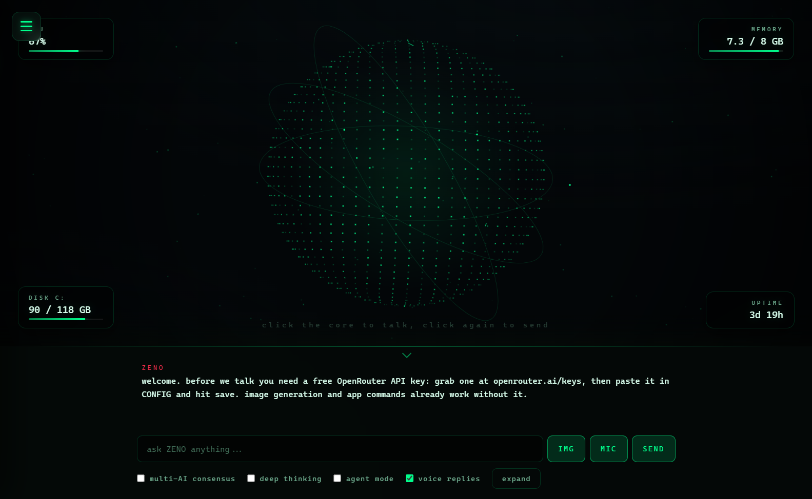
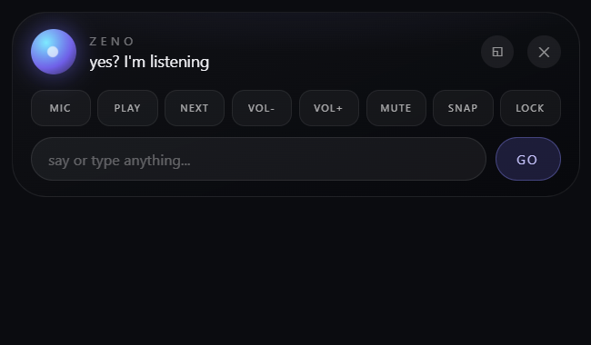

# ZENO

My take on a personal Jarvis, now grown into a full assistant. It's a Windows desktop app with a spinning holographic globe you click and talk to, plus a system-wide voice assistant you summon with Ctrl+Y from anywhere. Under the hood it runs on whatever AI model you point it at, but it works out of the box with the free ones on OpenRouter, so using it costs nothing.

Made by Team ZAP: [teamzap.uk](https://teamzap.uk/)

### Main window


### Ctrl+Y floating assistant


I built this because I wanted one place where I could ask questions, control my PC and mess around with different models without opening six browser tabs. It grew from there.

## Getting it

Grab `ZENO-Setup` from the [latest release](https://github.com/iamyakay/zeno/releases/latest). One click, desktop shortcut, done. There's also a portable exe if you don't like installers, it just needs about half a minute to unpack itself on each launch.

Windows will probably show a SmartScreen warning because the app isn't code signed. Click More info, then Run anyway.

Running from source needs Node 18 or newer:

```
git clone https://github.com/iamyakay/zeno.git
cd zeno
npm install
npm start
```

Whichever way you install, open CONFIG on first launch, paste an OpenRouter API key (free at [openrouter.ai/keys](https://openrouter.ai/keys)) and hit save. The image generator and the PC commands work even without a key.

## What's new in 2.0

**The assistant island.** Press Ctrl+Y anywhere in Windows and a black pill drops from the top of your screen, greets you out loud and starts listening. Speak or type, get an answer, and it's gone again. It handles quick questions, PC commands and even full agent tasks without you ever opening the main window.

**Agent mode.** Flip the agent toggle and ZENO stops just talking about tasks and starts doing them. It writes code files, creates whole projects, runs and tests them, installs packages, fixes its own errors and reports back with what it built and where. Ask it to "make me a snake game in python" and watch the steps tick by live.

**Voice that actually hears you.** Speech recognition now streams what it's hearing into the input as you talk, waits longer for you to start, and keeps partial results if you trail off instead of throwing everything away. Replies come back in a warm female voice.

**Deep thinking.** Toggle it on and ZENO privately reasons through your question first, then answers using its own notes. Slower, noticeably smarter on hard questions.

**Token counter, copy buttons and more.** Every reply shows exactly how many tokens it cost, plus a running session total. Hover any reply for a one-click copy button.

## What it does

You talk to it. Click the globe, say what you want, and it answers out loud. Replies stream in as they generate. Turn on the wake word in CONFIG and you can just say "hey zeno" from across the room, or press Ctrl+Y anywhere for the quick assistant.

It controls your computer. Ask it to open sites and apps, search the web, change the volume, lock the screen, take screenshots, empty the recycle bin or shut the PC down on a timer. There's a live HUD around the globe showing cpu, memory, disk and uptime, and asking "system status" gets you a spoken report.

It builds things. In agent mode it creates files and folders, writes real code, runs shell commands, tests what it built and iterates until it works.

It sees things. Attach an image and ask about it, or say "look at my screen" and ZENO screenshots your display and tells you what's there. Drop a text file into the window and ask questions about its contents. Say "generate an image of whatever" and a picture appears in the chat.

It remembers. Tell it to remember something and that survives restarts. It keeps a todo list in a panel next to the globe, saves every conversation into a history browser you can resume from, and picks up your clipboard when you ask it to summarize, translate or fix whatever you copied.

The multi-AI consensus mode is my favorite part. Flip the toggle and your question goes to several models at once, each with a live timer racing next to it, and a judge model merges what they agree on. When they disagree you get told what's disputed instead of one model's confident guess.

If none of that fits what you need, the personality is editable in CONFIG and the whole command layer is extendable through plugins.

## The commands

```
ctrl+y                    summon the assistant anywhere
open youtube / github / spotify / notepad / calculator / downloads / anysite.com
search best mechanical keyboards
make me a portfolio website        (agent mode)
generate an image of a neon samurai
look at my screen
weather in tokyo          time in new york
system status             take a screenshot
volume up / mute          lock the pc
shutdown in 10 minutes    cancel shutdown
remember my exam is friday
add buy milk to my list   done buy milk
summarize my clipboard    translate my clipboard to spanish
roll a d20                flip a coin
```

Everything in that list also works by voice.

## Plugins

Drop a js file into the `plugins` folder (or into `plugins` inside ZENO's user data folder if you installed the exe) and restart. A plugin is just a name, a regex and a function:

```js
module.exports = {
  name: "hello",
  description: "says hi back",
  pattern: /^say hi/i,
  run(input, ctx) {
    return "hi. what do you need?";
  }
};
```

Whatever you return gets shown in the chat and spoken. The `ctx` object hands you `fetch`, `openUrl` and `ps` for running PowerShell. The dice roller that ships with the app is a working example.

## How the code is laid out

The main process lives in `lib`: config handling, the json stores, the OpenRouter client, the agent tool loop, the system layer that talks to Windows, plugin loading and the update check are separate modules that `main.js` wires together. The renderer side splits the same way, `js/globe.js` draws the planet, `js/voice.js` handles speech, `js/engine.js` runs conversations and consensus, `js/markdown.js` and `js/commands.js` do rendering and intent parsing, `js/overlay.js` powers the Ctrl+Y island, and `js/app.js` glues the UI together.

Settings and data are plain json files in your user folder. Nothing leaves your machine except the API calls you make.

## Changelog

**2.4.0**  streaming replies: the overlay now shows tokens as they arrive instead of waiting for the full answer. Command history: press up-arrow to recall your last 40 commands. Conversation mode: ZENO re-opens the mic after speaking so you can go back and forth hands-free. Auto-update: downloads the installer in the background and installs on next quit, with a progress line in the banner. Start with Windows: CONFIG toggle to launch ZENO on login, minimized to tray. Activity log: a new LOG view lists every action and agent task ZENO ran. Destructive-command confirmation: a toast pops before any agent task that contains delete, remove, format or similar words. Config toggles wired for all of the above.

**2.3.0**  the floating hub update. The Ctrl+Y island is now a full control surface: drag it anywhere on screen and it remembers its spot, quick buttons for play/pause, skip, volume, mute, screenshot and lock, plus voice and chat, so the main window becomes optional. The whole interface got a premium pass with glass panels, layered glows and springy motion. And commands that were never programmed now work anyway: if a request doesn't match anything built in, ZENO describes the action and safely executes it through agent mode.

**2.2.0**  ZENO finally hears you properly. Speech recognition is now OpenAI's Whisper AI running locally on your PC, replacing the ancient Windows recognizer entirely. It records through your mic with noise suppression, detects when you stop talking, and transcribes with an actual AI model, offline and free. First launch downloads the engine and model (about 150 MB, one time, automatic). The old recognizer stays as a fallback if setup fails.

**2.1.0**  real AI voice and understands everything. ZENO now speaks with Microsoft's neural AI voice (Aria) for free, no key needed, and falls back to the local voice offline. New AI intent router: commands that aren't in the built-in list still work, "open valorant", "pause the music", "skip this song", "close chrome", "put the pc to sleep" all get understood and executed, and ZENO can now launch any app installed on your PC by name.

**2.0.1**  voice recognition tuned: shorter listening window, faster end-of-speech detection, forced en-US recognizer, clear no-microphone error. The assistant now waits for the greeting to finish before listening so it doesn't hear itself. Removed the shadow around the assistant island. ZENO now lives in the system tray: closing the window keeps it running in the background with Ctrl+Y still active, quit from the tray menu. Proper app icon.

**2.0.0**  the ultimate update. Ctrl+Y assistant island, agent mode that creates files and runs commands, rebuilt voice recognition with live transcription, female voice, deep thinking mode, per-reply token counts with session totals, copy buttons on every reply, infrastructure page, [teamzap.uk](https://teamzap.uk/).

**1.2.0**  streaming replies, chat history browser, plugins, update banner.

**1.1.0**  consensus mode, wake word, screen vision, todo list.

**1.0.0**  first release.

## Credits

Made by Zap / Team ZAP. Website [teamzap.uk](https://teamzap.uk/), GitHub [iamyakay](https://github.com/iamyakay), Discord Sethlowk.

MIT licensed, do what you want with it.
